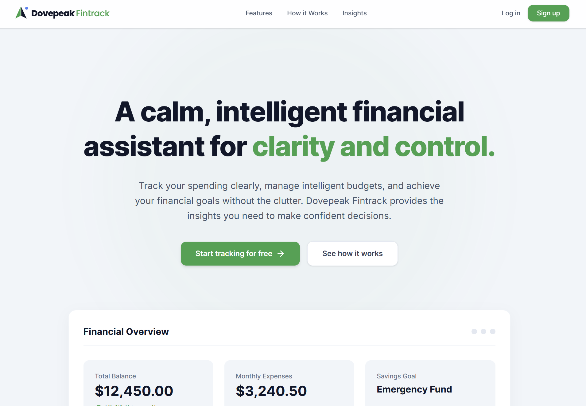

#  Dovepeak-Fintrack (DFT)

## Overview

**Dovepeak-Fintrack (DFT)** is a modern, serverless personal finance management web application designed to help individuals take control of their financial lives through structured tracking, analysis, and planning.

The platform enables users to monitor income, track expenses, manage debts, set financial goals, and gain insights into their spending behavior — all in one centralized system.

---

## Purpose

The primary goal of DFT is to promote **financial discipline and awareness** by providing users with tools to:

- Track and categorize financial transactions
- Monitor spending habits
- Plan budgets effectively
- Manage debts and repayments
- Set and achieve financial goals
- Understand cash flow patterns

---

##  Target Users

- Students managing limited budgets  
- Young professionals building financial habits  
- Freelancers with irregular income  
- Individuals seeking better financial control  

---

##  Key Features

### Authentication & User Management
- Secure user registration and login
- Session management
- Password reset functionality

---

### Income Management
- Add and manage multiple income sources
- Support for recurring income (e.g., salary)
- Income history tracking

---

### Expense Tracking
- Record daily expenses
- Categorize spending (e.g., food, rent, transport)
- Attach receipts (Cloudinary integration)
- Recurring expense tracking

---

### Budgeting System
- Set budgets (monthly/weekly)
- Category-based budget allocation
- Budget vs actual comparisons
- Alerts for overspending

---

### Cash Flow Analysis
- Income vs expenses overview
- Net balance tracking
- Monthly and trend-based insights

---

### Financial Goals
- Create savings goals
- Track progress toward targets
- Set deadlines and milestones

---

### Debt & Loan Management
- Track borrowed and lent money
- Monitor repayment progress
- Set due dates and reminders

---

### Transactions System
- Centralized transaction log
- Filter, search, and sort records
- Unified view of financial activity

---

### Notifications & Alerts
- Budget limit warnings
- Debt repayment reminders
- Goal deadline alerts

---

### Insights & Reports
- Spending breakdowns
- Category analysis
- Financial summaries and reports

---

### Settings & Customization
- Profile management
- Currency settings
- Data export (CSV/PDF planned)

---

## Tech Stack

### Frontend
- Next.js (App Router)
- React
- Tailwind CSS

### Backend (Serverless)
- Next.js API Routes / Server Actions

### Database & Auth
- Supabase (PostgreSQL + Authentication)

### Media Storage
- Cloudinary (for receipts and images)

### Deployment
- Vercel

---

## 🧩 Architecture Overview

DFT follows a **modular and scalable architecture**:

- **App Router Structure** for clean routing and layouts
- **Serverless APIs** for backend logic
- **Supabase** for real-time database and authentication
- **Reusable components** for UI consistency
- **Separation of concerns** via `lib`, `hooks`, and `types`

---

##  Project Structure

app/ # Application routes (Next.js App Router)
components/ # Reusable UI components
lib/ # External services and utilities
hooks/ # Custom React hooks
types/ # TypeScript definitions
constants/ # Static configuration data
public/ # Static assets
styles/ # Global styles
api/ # Serverless endpoints

---

## Core Workflows

### Example: Adding an Expense

1. User submits expense form  
2. Data is validated and sent to API  
3. Stored in Supabase database  
4. Budget recalculated automatically  
5. Dashboard updates in real-time  
6. Alert triggered if budget exceeded  

---

## Development Approach

The project is built incrementally in phases:

### Phase 1 (MVP)
- Authentication
- Expense tracking
- Transactions log
- Basic dashboard

### Phase 2
- Budgeting system
- Financial goals
- Debt management

### Phase 3
- Insights and analytics
- Notifications
- Advanced reporting

---

## Future Enhancements

- AI-powered financial insights
- Mobile app (React Native)
- Integration with payment systems (e.g., mobile money)
- Multi-user/shared budgeting
- Progressive Web App (offline support)

---

## Design Philosophy

DFT is built with a focus on:

- **Simplicity** → Easy to use daily  
- **Clarity** → Clear financial insights  
- **Scalability** → Modular architecture  
- **Practicality** → Real-world usability  

---

## Project Status

Currently in active development (MVP stage)

---

## Contribution

This project is currently under development. Contributions, ideas, and feedback may be welcomed in future iterations.

---

## License

This project is for educational and development purposes. Licensing will be defined in future releases.

---

## Author

**Joseph Kirika**  
---

## Final Note

Dovepeak-Fintrack is more than just a tracking tool — it is a system designed to help users build **long-term financial discipline and smarter money habits**.